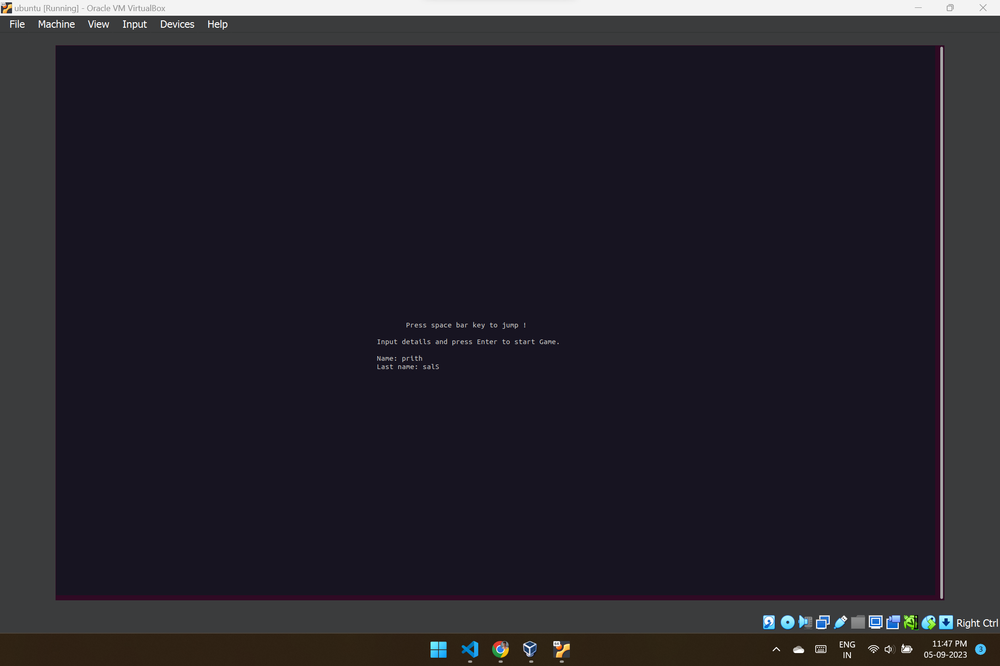
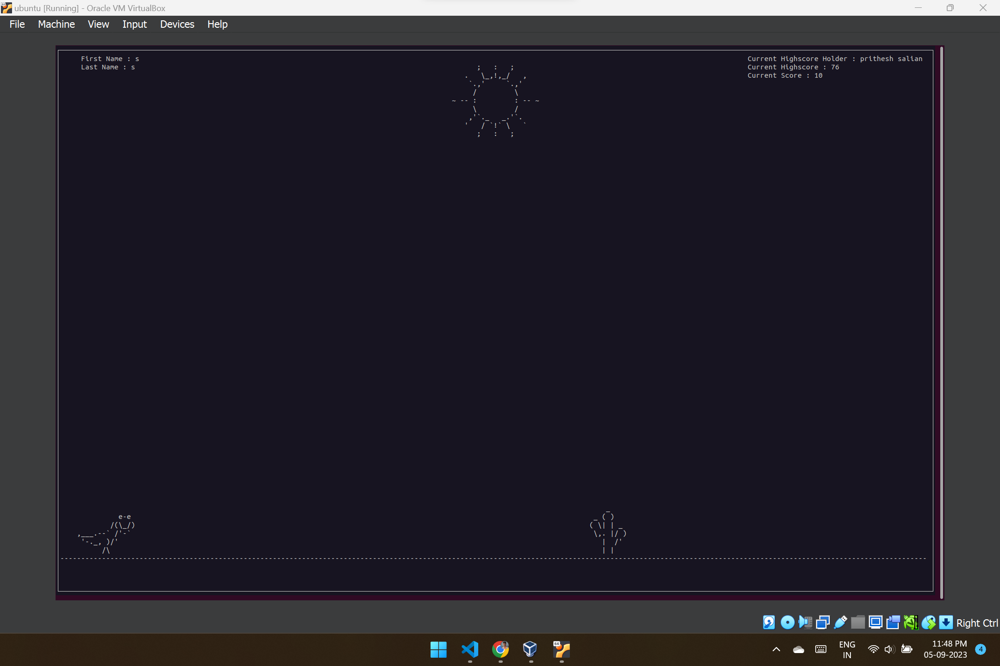
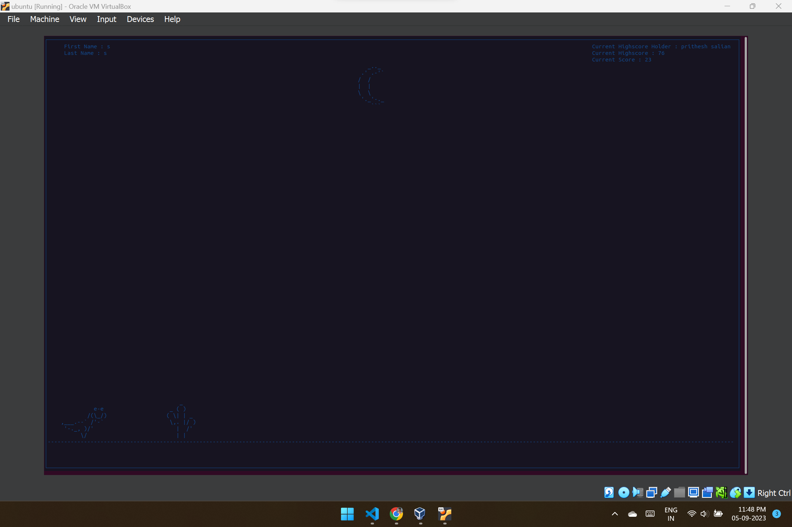

# Chrome Dinosaur
#### Google Chrome dinosaur game using Ncurses in C (T-Rex)

You can jump using 'Space' Key, and you can fire when Prize was equal to 1 using 'k' Key.

##### To compile and run:

(Make sure you have Ncurses library installed!)

```shell
gcc main.c -lncurses -o main.out
./main.out
```





